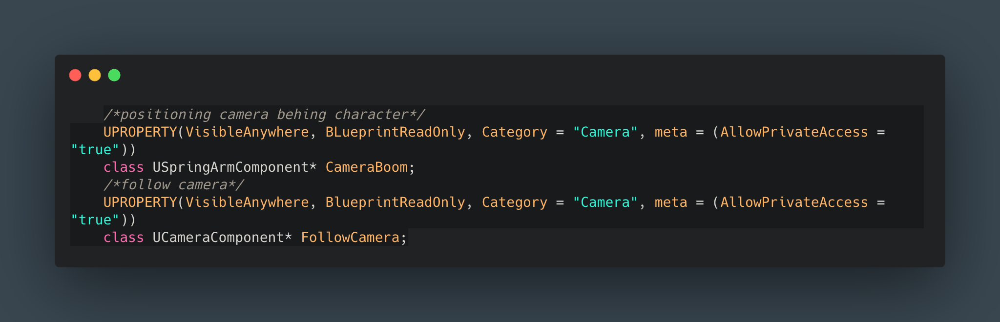
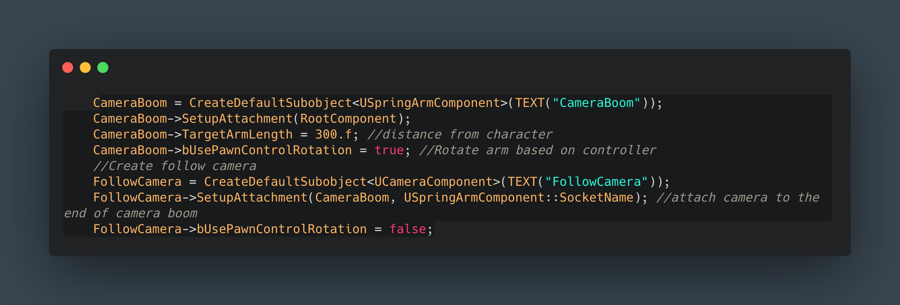
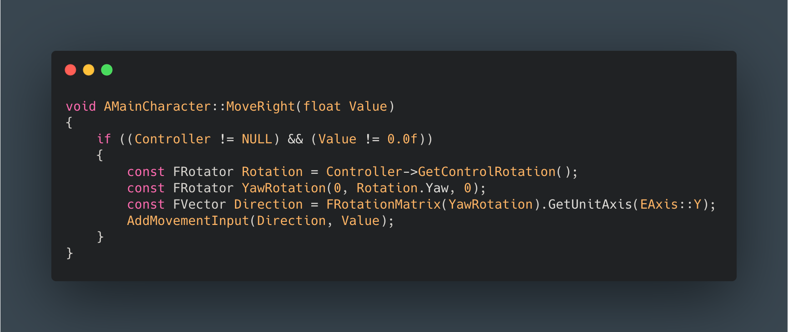
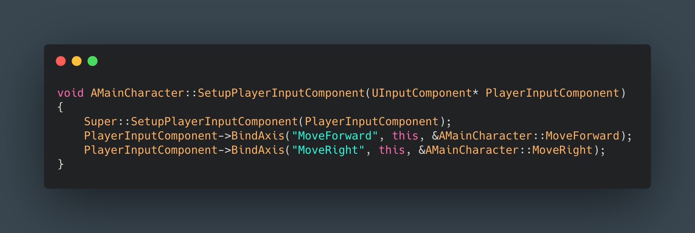
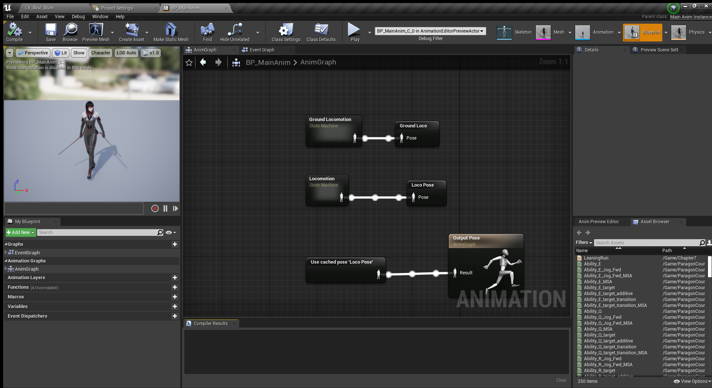
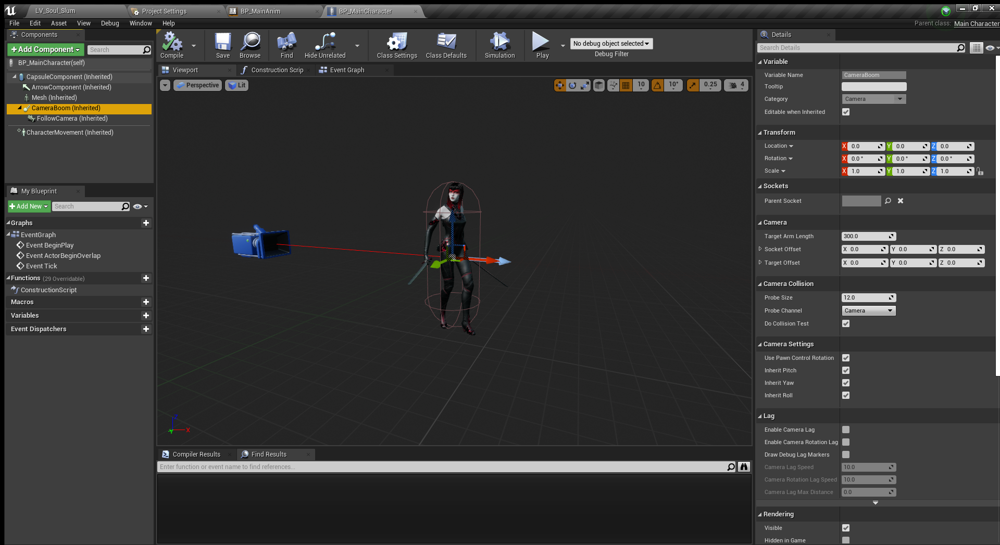
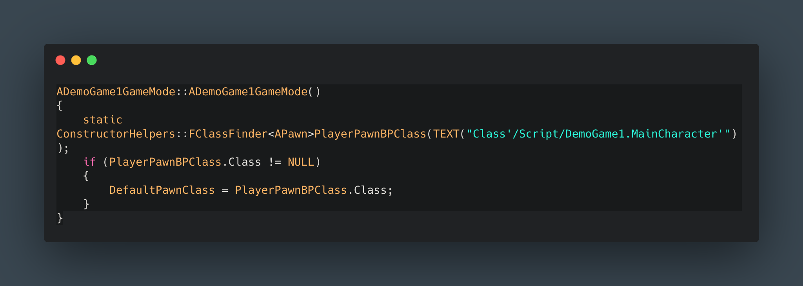

## GAME DEVELOPMENT

UNREAL ENGINE / C++ / BLUEPRINTS
  
Built a combat demo game in UE with C++ and Blueprints. You can check out the project's repo **[here.]()**
  
- - -
  
C++ Code
  
Adding Camera Components to Character. I am creating a camera and position of camera component variables of type class so I can place the camera from a certain distance from behind my main Character. Set it up in my Characters Blueprint. For best practice I decided to pass AllowPrivateAccess as true so only instances of this class can access these variables in Blueprints.
  

  
Declaring my camera and camera position component (camera boom). I am setting my camera position as my root component for my character and using a value of 300 which can be update it to whatever value you prefer. And notice that I am setting the "bUsePawnControlRotation" to true so I can rotate the camera as a whole based on Character's controller. For the actual camera I am attaching it to my root component which is the camera boom with the function SetupAttachment. Once compiled should be accessible and visible in Blueprints.
  

  
In oder to get user input and move my character around the world I created a MoveForward and MoveRight functions within my Character's cpp file. They both signatures are void since I am calling a Pawn built-in function "AddMovementInput" which will proceed to move the Character. The only difference between these two functions is the axis where they are moving along. Moving forward or backwards is within the X axis while right or left happens in the Y axis. Since movement it is dictated by a matrix I need direction and magnitude, please see function for reference.
  
It is important to check if Controller is not null since it might causes crashes within our game and also that a value was actually passed to this function as well. The MoveForward  Get the UniAxis but with X as a parameter. Since you can have negative values these functions can handle move left and move backwards respectively.
  

  
It is important to mention that both functions need to be registered in the character input component function. You also need a declaration in your project setting in Unreal (under engine -> input) the same naimg for axis and action functions.
  

  
- - -
  
ANIMATION
  
Notes and code to handle different states of animations will be added here soon...
  

  
- - -
  
BLUEPRINTS
  
As mentioned in C++ code section, here you can see how the camera boom is set as root component and the actual camera is attached to it. 
  

  
To make sure our game loads by default the new Character class we declare/update the default pawn class in the Game .cpp file
  

  
- - -