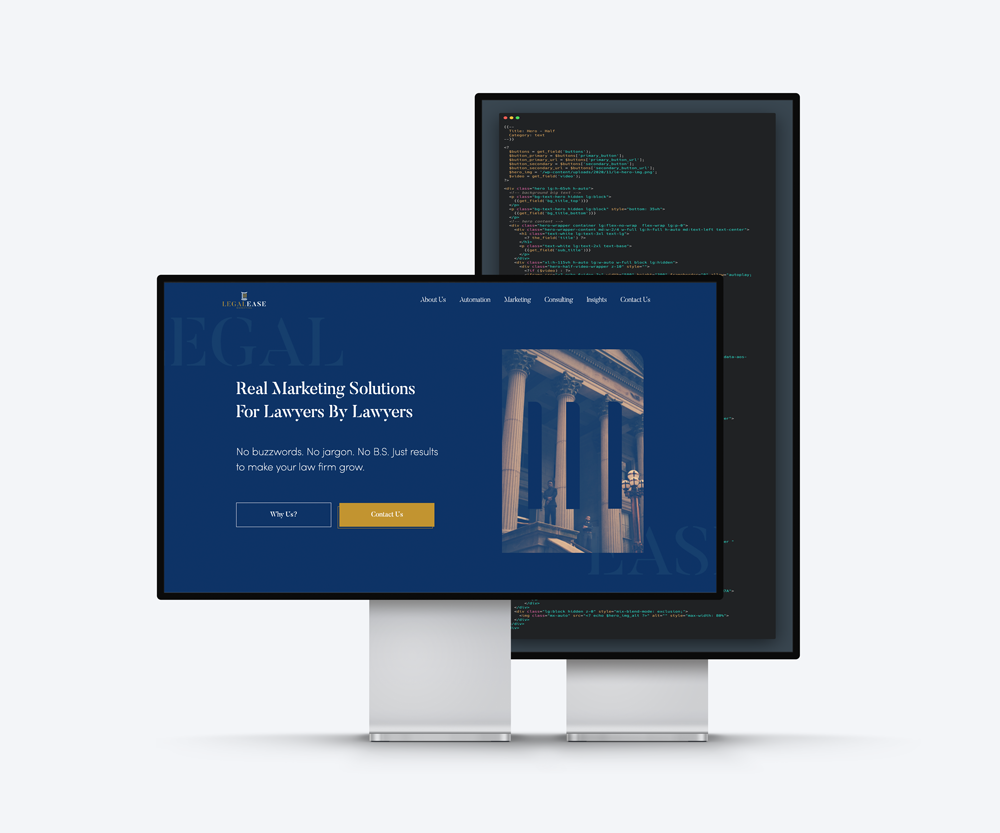

## WEB DEVELOPMENT

WORDPRESS / SAGE / TAILWIND
  
Created a fully customed theme for this client using SAGE and ACF. Provided a flexible and easy to update site for the client thanks to ACF and component based with sage.
  
- - -
 
Features
  
- Easy content updates with ACF gutenberg blocks.
  
- Flexible components with conditionals so you can reuse for different purposes i.e content having a cta, alignment of such, etc. All set from gutenberg.
  
- JSON animation for icons for speed performance.
  
- Global Header and Footer dashboard components.
  

**[visit page](https://legaleasemarketing.com/)**
**[check repo]()**

- - -
