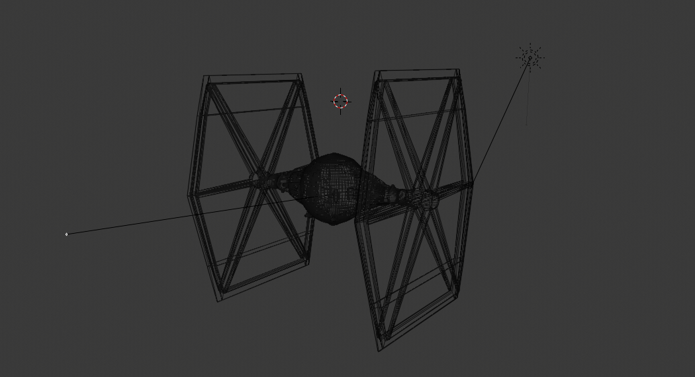
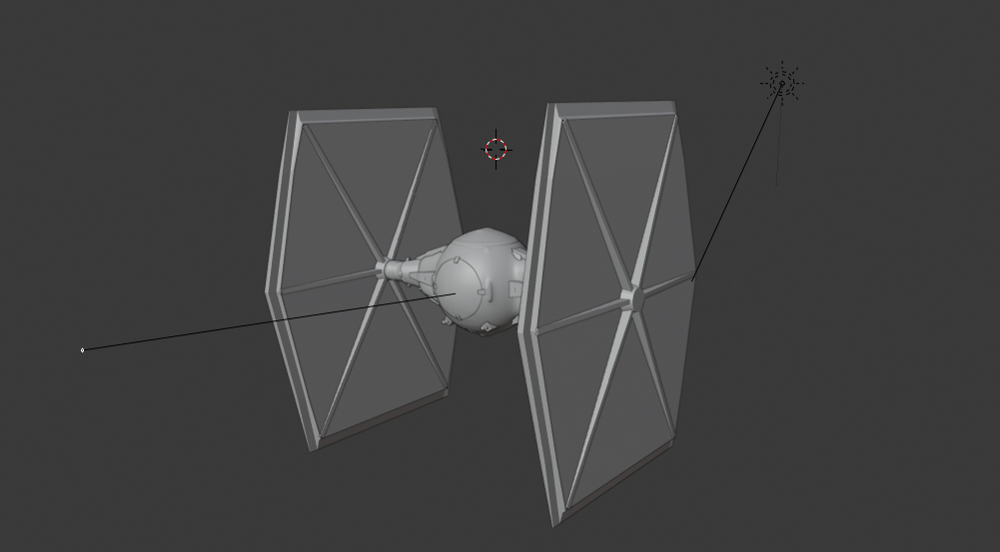
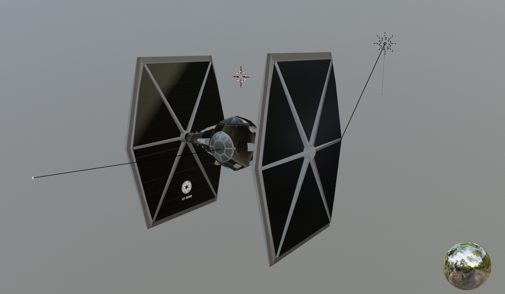
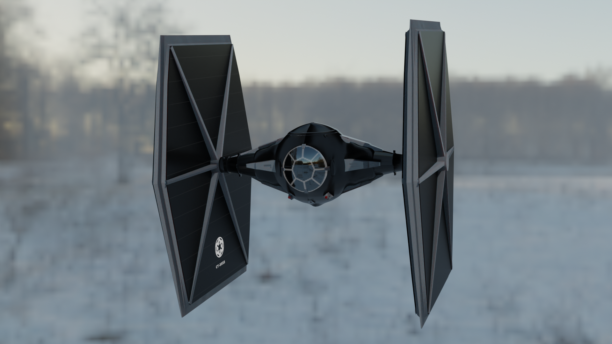

## 3D Art

BLENDER / PHOTOSHOP
  
Built a TieFighter in Blender
  
- - -
  
Wireframe view
  

  
- - - 
  
Solid view
  

  
- - -
  
Material view
  

  
- - -
  
Render view (cycles)
  

  
- - -
  