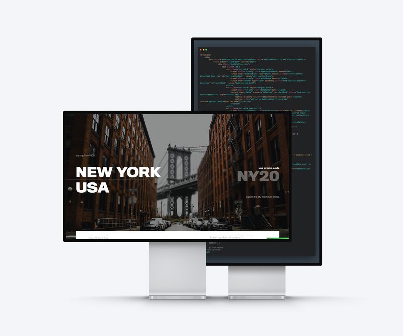

## WEB DEVELOPMENT

LARAVEL / VUE JS
  
Project proposal built in Laravel with Vue JS for client travel agency. Was able to create a vue component route to fetch data in a single blade page for different destinations. 
  
Features:
- Single page app with Vue Router
- Mapbox integration
- Dynamic itinerary generator based on travel dates
- Fetching data from JSON to easily add travel destinations
- Booking confirmation email
  
**[visit page](https://travel-app-carlos-caro.herokuapp.com/)**
**[check repo](https://github.com/MrCaro/travel-app)**

- - -

 